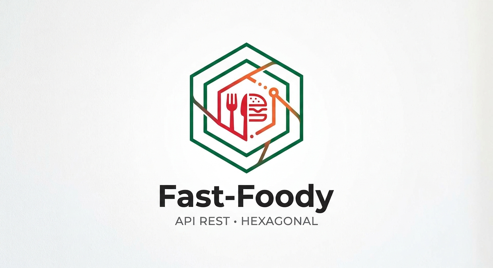
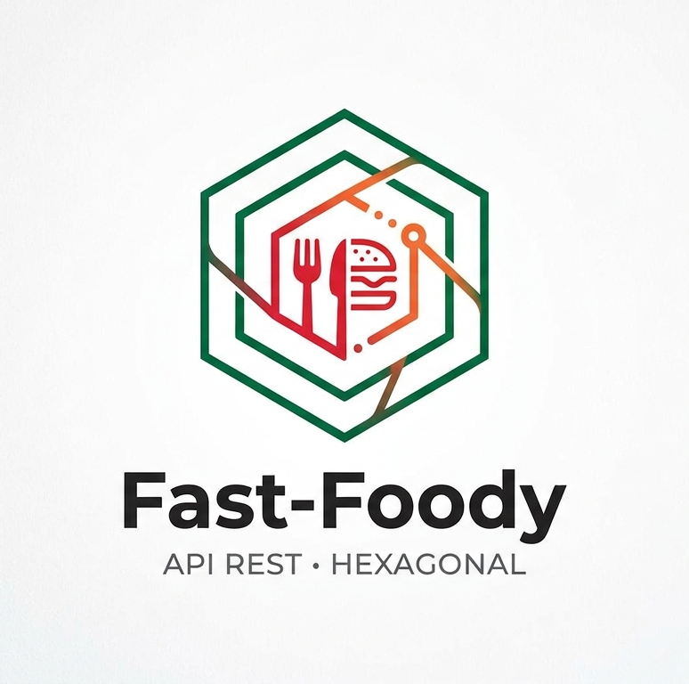

<p align="center">
  
</p>

<div align="center">
  
  <h1>🍔 Fast Foodiy</h1>
  <p>
    <b>Proyecto fullstack</b> de gestión de pedidos para un restaurante de comida rápida:
    catálogo de productos y órdenes de clientes, desde su creación hasta su entrega o cancelación.
  </p>
  <p>
    Empezó como una <b>REST API</b> (backend en <b>Vercel</b> con persistencia <b>Upstash Redis</b>)
    y evolucionó a una <b>app web completa</b>: frontend en <b>React + Vite</b> (GitHub Pages),
    autenticación por roles (cliente / staff / admin) y <b>despliegue automático</b> con CI/CD.
  </p>

  <!-- Shields -->
  <p>
    <a href="https://github.com/iCruzDaniel/fast-foody"></a>
    <a href="https://github.com/iCruzDaniel/fast-foody"></a>
    <a href="https://github.com/iCruzDaniel/fast-foody"></a>
    <a href="https://github.com/iCruzDaniel/fast-foody"></a>
    <a href="https://github.com/iCruzDaniel/fast-foody"></a>
    <a href="https://github.com/iCruzDaniel/fast-foody"></a>
    <a href="https://github.com/iCruzDaniel/fast-foody"></a>
    <a href="https://github.com/iCruzDaniel/fast-foody"></a>
    <a href="https://github.com/iCruzDaniel/fast-foody"></a>
    <a href="https://github.com/iCruzDaniel/fast-foody"></a>
    <a href="https://github.com/iCruzDaniel/fast-foody"></a>
    <a href="https://github.com/iCruzDaniel/fast-foody"></a>
    <a href="https://github.com/iCruzDaniel/fast-foody"></a>
    <a href="https://github.com/iCruzDaniel/fast-foody"></a>
  </p>

  <!-- Estado -->
  <p>
    <a href="https://github.com/iCruzDaniel/fast-foody/actions"></a>
    <a href="https://github.com/iCruzDaniel/fast-foody"></a>
    <a href="https://github.com/iCruzDaniel/fast-foody/blob/main/LICENSE"></a>
  </p>
</div>

---

## 🚀 Prueba en vivo

Todo el stack está desplegado y funcionando con **CI/CD automático** (cada push a
`main` redespiega frontend y backend):

| Capa | Enlace |
|---|---|
| 🖥️ **App web (frontend)** | **https://icruzdaniel.github.io/fast-foody/** |
| ⚙️ **API REST (backend)** | **https://fast-foody.vercel.app/api/v1** |

> **Demo lista para probar:** entra a la app y usa los botones **Autologin Cliente** /
> **Autologin Staff Admin** en la página de Login (seed de demo con datos + usuarios ya
> cargados). O prueba la API directamente:
>
> ```bash
> # Catálogo de productos
> curl https://fast-foody.vercel.app/api/v1/products
>
> # Login de staff demo (admin / admin123)
> curl -X POST https://fast-foody.vercel.app/api/v1/auth/login/staff \
>   -H "Content-Type: application/json" \
>   -d '{"username":"admin","password":"admin123"}'
> ```

---

## Stack

Proyecto **fullstack**: API backend + app web frontend + despliegue automático.

**Backend** (REST API — el núcleo original):

- **Runtime:** Node.js 20+ / TypeScript (strict)
- **Framework:** Express
- **ORM:** Prisma (PostgreSQL)
- **Persistencia alternativa:** Upstash Redis (serverless, usada en el deploy de Vercel)
- **Autenticación:** JWT (HS256) en cookie httpOnly + bcryptjs
- **Validación:** Zod
- **Testing:** Vitest

**Frontend** (app web):

- **React 19 + Vite + Tailwind CSS v4**
- **Despliegue:** GitHub Pages (`https://icruzdaniel.github.io/fast-foody/`)

**Infra / CI-CD:**

- **Vercel** (backend API serverless con Build Output API + esbuild)
- **GitHub Actions** (workflow para publicar el frontend en Pages)
- **Docker + docker-compose** (dev/PostgreSQL)

> **De API a app completa.** El proyecto empezó como una REST API pura (dominio
> hexagonal + use cases + adaptadores de persistencia). Con el tiempo se le sumó
> un **frontend en React**, autenticación por roles, y **despliegue automático**
> (Vercel para la API + GitHub Pages para el frontend). Hoy es un producto
> fullstack, pero la arquitectura hexagonal original se mantiene intacta: la API
> sigue siendo el corazón del sistema y el frontend consume sus endpoints.

## Arquitectura: Hexagonal (Ports & Adapters) + DDD

```
src/
├── domain/                    # Lógica de negocio pura (sin dependencias externas)
│   ├── order/                 # Agregado Order (raíz), OrderItem, OrderStatus, eventos
│   ├── product/               # Agregado Product
│   ├── customer/              # Entidad Customer
│   └── auth/                  # StaffAccount, CustomerAccount, StaffRole, session ports
├── application/               # Use Cases (orquestación, sin reglas de negocio)
│   ├── order/use-cases/       # 6 use cases de Order
│   ├── product/use-cases/     # 5 use cases de Product
│   └── auth/use-cases/        # login, registro, sesión actual, logout
├── infrastructure/
│   ├── adapters/in/http/      # Controllers, routes, DTOs (Zod), middlewares
│   ├── adapters/out/persistence/
│   │   ├── in-memory/         # Repos en Map (tests + dev sin DB)
│   │   ├── postgres/          # Repos Prisma + mappers toDomain/toPersistence
│   │   └── upstash/           # Repos Upstash Redis (serverless, demos) + auth
│   ├── adapters/out/security/ # JsonWebTokenSession, PasswordHasher
│   ├── adapters/out/events/   # ConsoleEventPublisher
│   ├── config/                # env.ts, db.ts
│   └── container/             # Composition root (DI wiring)
├── shared/kernel/             # Entity, ValueObject, AggregateRoot, DomainError
└── server.ts                  # Bootstrap
```

> El frontend (React + Vite) vive en `frontend/`. Solo el compositor (`container/`) conecta la autenticación; la capa de dominio y de aplicación de `auth/**` nunca dependen de Express, Prisma o Upstash.

### Regla de dependencias

```
domain ← application ← infrastructure (nunca al revés)
```

- `src/domain/**` y `src/application/**` **nunca** importan Express, Prisma, ni Docker
- Solo `src/infrastructure/container/` une todo (composition root)
- Prisma types (`Prisma.*`, `PrismaClient`) confinados a `src/infrastructure/adapters/out/persistence/postgres/**`

## Autenticación y control de acceso por roles (RBAC)

El contexto "Ordering" se extendió con un sub-contexto de **Autenticación**. Persiste **solo** en el driver `upstash` (no en `memory`/`postgres`), porque es la persistencia elegida para las demos serverless.

### Tres roles

| Rol | `SessionRole` | Acceso |
|-----|---------------|--------|
| Cliente | `CUSTOMER` | Catálogo, carrito, checkout y seguimiento de propios pedidos |
| Staff | `STAFF` | Consola de staff (pedidos, cocina) |
| Admin | `ADMIN` | Todo lo de staff + gestión de productos y registro de staff |

### Decisiones técnicas

- **Sesión** = cookie httpOnly `ff_session` (`SESSION_COOKIE`) que transporta un **JWT HS256** firmado con `SESSION_SECRET`. El token NO se expone a JS del navegador (defensa contra XSS).
- **Contraseñas** hasheadas con **bcryptjs** (`PasswordHasherPort` → `PasswordHasher`).
- **Login de cliente** por `phone + nationality (+57) + password`. **Login de staff** por `username + password`.
- **RBAC en infra**: `createAuthMiddleware({sessionService})` devuelve `requireAuth` (valida cookie, inyecta `res.locals.session = {sub, role}`, 401 si falta/inválida) y `requireRole(roles)` (403 si el rol no matchea). Las rutas combinan ambos: `requireAuth` + `requireRole(['ADMIN'])` para registrar staff.
- **Regla de autorización**: **solo el rol `ADMIN` puede registrar staff** (`POST /api/v1/auth/register-staff`).
- **Async handlers**: Express 4 no captura rechazos de promesas en handlers `async`; se envuelven con `asyncHandler` para que los `DomainError` lleguen al error middleware y mapeen su status (400/401/403/404/409) en vez de romper el proceso.

### Endpoints `/api/v1/auth`

| Método | Endpoint | Auth | Descripción |
|--------|----------|------|-------------|
| `POST` | `/auth/register-customer` | pública | Registrar cuenta de cliente (name, phone, nationality, password) |
| `POST` | `/auth/login/customer` | pública | Login cliente (phone, nationality, password) → setea cookie |
| `POST` | `/auth/login/staff` | pública | Login staff (username, password) → setea cookie |
| `POST` | `/auth/register-staff` | `requireAuth` + `requireRole(['ADMIN'])` | Registrar cuenta de staff (solo admin) |
| `POST` | `/auth/logout` | cookie (opcional) | Limpia la cookie de sesión |
| `GET` | `/auth/me` | `requireAuth` | Devuelve `{ role, customer:{...} }` o `{ role, staff:{...} }` |

### Códigos de error añadidos

| HTTP | Código `DomainError` | Significado |
|------|----------------------|-------------|
| 401 | `UNAUTHENTICATED` | Falta cookie o token inválido/expirado |
| 403 | `FORBIDDEN` | Sesión válida pero carece del rol requerido |

### Usuarios demo (seed con DEMO_MODE y upstash)

| Usuario | Credenciales | Rol |
|---------|--------------|-----|
| Cliente Maria Lopez | phone `(555) 123-4567`, nacionalidad `+57`, password `customer123` | CUSTOMER |
| Staff | `staff` / `staff123` | STAFF |
| Admin | `admin` / `admin123` | ADMIN |

En el frontend, la página de Login muestra un banner "Demo Mode" con botones **Autologin Cliente** y **Autologin Staff Admin** (una cuenta por tipo de login) para entrar rápido.

### Frontend por roles

`frontend/` (React) separa dos experiencias por URL usando el rol de la sesión:

- **Cliente** (`/`, `/cart`, `/checkout`, `/orders`): catálogo, carrito y pedidos.
- **Staff/Admin** (`/staff`, `/staff/orders`, `/staff/kitchen`, `/staff/products`): guardados por `RequireStaff` (estructura `AuthProvider` + hooks `useIsStaff`/`useIsAdmin`/`useIsCustomer`). Un `CUSTOMER` que visita `/staff/*` es **redirigido a `/login`**.

## Arranque rápido

### Con Docker (recominado)

```bash
cp .env.example .env
docker-compose up
```

Levanta PostgreSQL + API. Las migraciones de Prisma se ejecutan automáticamente.

### Sin Docker (solo memoria)

```bash
npm install
PERSISTENCE_DRIVER=memory npm run dev
```

### Con Upstash Redis (demos / serverless, con autenticación)

```bash
npm install
PERSISTENCE_DRIVER=upstash \
DEMO_MODE=true \
UPSTASH_REDIS_REST_URL=https://your-redis.upstash.io \
UPSTASH_REDIS_REST_TOKEN=your-token-here \
npm run seed        # siembra catálogo + usuarios demo (admin/staff/cliente)
npm run dev
```

> La autenticación solo se monta con `PERSISTENCE_DRIVER=upstash`. Para que el
> seed cree los usuarios demo, añade `DEMO_MODE=true`.

### Frontend (dev con proxy a la API)

```bash
cd frontend
cp .env.example .env   # contiene VITE_API_URL=/api/v1 y VITE_DEMO_MODE=true
npm install
npm run dev            # Vite proxya /api/v1 -> localhost:3000
```

## Despliegue del frontend en GitHub Pages

Un workflow (`.github/workflows/deploy-gh-pages.yml`) compila el frontend y lo
publica en GitHub Pages automáticamente con cada `push` a `main` (o manual).

```bash
git push origin main
```

### Dónde van `VITE_API_URL` y `VITE_DEMO_MODE`

**No se leen del `.env` local** — las variables `VITE_*` se incrustan en los
estáticos **en tiempo de build** (`import.meta.env` no existe en runtime). El
workflow las lee de **repository Variables**:

`Settings → Secrets and variables → Actions → Variables`:

| Variable | Ejemplo para producción | Notas |
|----------|--------------------------|-------|
| `VITE_API_URL` | `https://api.tu-dominio.com` | Apunta al **origen** de tu API desplegada. **No** uses `/api/v1` (GitHub Pages no la proxya; `/api/v1` relativo apuntaría a `github.io/.../api/v1`, inexistente) |
| `VITE_DEMO_MODE` | `true` | Debe coincidir con `DEMO_MODE=true` del backend si quieres los autologin demo |

Si una variable queda vacía: `VITE_API_URL` cae a `/api/v1` y `VITE_DEMO_MODE` a `false`.

### Requisitos del side del Pages

1. En **Settings → Pages**, elige *Source → **GitHub Actions*** (no `Deploy from a branch`).
2. El sitio se publica bajo `https://<usuario>.github.io/<repo>/` (p. ej.
   `https://icruzdaniel.github.io/fast-foody/`). El workflow usa ese subpath como
   `--base` automáticamente, y el router (`BrowserRouter basename`) y los assets
   quedan alineados con él. El SPA se soporta con un `404.html` = `index.html`
   (GitHub Pages no reescribe rutas).

### CORS del backend (cross-origin)

Como el frontend usa `fetch` con `credentials: 'include'` (cookie `ff_session`)
y en producción la API vive en un **origen distinto** al de Pages, el backend
debe permitir ese origen. Configura `CORS_ORIGIN` en el entorno de la API
(separado por comas):

```bash
CORS_ORIGIN=https://icruzdaniel.github.io NODE_ENV=production npm run dev
```

El middleware `cors` (montado en `container.ts`) emite
`Access-Control-Allow-Credentials: true` y el `Access-Control-Allow-Origin`
exacto; con `CORS_ORIGIN` vacío refleja cualquier origen (útil en dev con
proxy misma-parte; no lo uses así en producción con credenciales).

## Despliegue del backend en Vercel

El backend Express se empaqueta para Vercel (serverless) con `esbuild`
(`vercel.json` + `npm run build:vercel`). El frontend **no** se despliega aquí
(va a GitHub Pages, ver sección anterior).

### Cómo funciona el build

`build:vercel` bundlea `src/vercel-entry.ts` con **esbuild**, **resolviendo los
aliases `@domain/*`, `@shared/*` y `@application/*`** que el `tsc` no reescribe
en el output. `@prisma/client` queda **external** (lo instala Vercel vía
`node_modules`; solo se invoca si eliges el driver `postgres`).

Luego `scripts/create-vercel-output.js` ensambla el **Build Output API** de
Vercel en `.vercel/output/`:

- `functions/api.func/index.js` — el bundle CJS; `src/vercel-entry.ts` usa
  `export = app`, así el `module.exports` **ES** el app Express.
- `functions/api.func/.vc-config.json` — `handler: "index.js"` +
  `launcherType: Nodejs` + `shouldAddHelpers: true`, que hace que Vercel
  envuelva el app Express como función serverless.
- `config.json` — `version: 3`, con `handle: filesystem` (sirve estáticos
  primero) y `{ "src": "/api/(.*)", "dest": "/api" }`, que envía todas las
  rutas `/api/*` a la función. Vercel conserva la ruta original, así el app
  Express interno (rutas `/api/v1/*`) matchea directamente.

- `src/vercel-entry.ts` construye el container y expone el app (`export = app`).
- `src/server.ts` usa el mismo app con `app.listen` (dev local: `npm run dev`).
- `vercel.json`: `framework: null`, `buildCommand: npm run build:vercel` y
  `outputDirectory: .vercel/output` (necesario para que Vercel descubra el
  build output). `.vercel/output/` está en `.gitignore` (se genera en build).

> **Por qué Build Output API y no `builds`/`routes` de `vercel.json`:** el `src`
> de un `build` se evalúa contra el snapshot del repo ANTES de correr el build,
> así que un bundle gitignored (`dist/`) nunca registraba la función (el error
> que devolvía 404 en todas las rutas). El Build Output API registra la función
> DESPUÉS del `buildCommand`, escaneando `.vercel/output/functions/**`, lo que
> evita esa carrera y no exige commitear el bundle.

### Desplegar

```bash
vercel        # liga el proyecto y genera preview
vercel --prod # despliega producción
```

### Variables de entorno en Vercel

Se configuran en **Vercel → Project → Settings → Environment Variables**
(Production). Mínimas para el driver `upstash`:

| Variable | Valor |
|----------|-------|
| `PERSISTENCE_DRIVER` | `upstash` |
| `UPSTASH_REDIS_REST_URL` | tu URL REST de Upstash |
| `UPSTASH_REDIS_REST_TOKEN` | tu token REST de Upstash |
| `SESSION_SECRET` | valor fuerte (`openssl rand -hex 32`) |
| `SESSION_TTL` | `604800` (7 días) |
| `DEMO_MODE` | `true` (para sembrar usuarios demo) |
| `NODE_ENV` | `production` (cookie `Secure`) |
| `CORS_ORIGIN` | el origen del frontend, ej. `https://icruzdaniel.github.io` (**no** la URL de la API en vercel.app) |

El CORS lo resuelve el middleware `cors` del propio Express (montado en
`container.ts`): responde `Access-Control-Allow-Origin` con el origen exacto y
`Access-Control-Allow-Credentials: true`, necesario porque el frontend usa
`credentials: 'include'` (cookie `ff_session`). Configura `CORS_ORIGIN` con el
**origen que llama** (GitHub Pages), separado por comas si hay varios. Con el
valor vacío refleja cualquier origen (no apto para producción con credenciales).

Para que la demo tenga datos + usuarios, ejecuta `npm run seed` (con `DEMO_MODE=true`)
cuando la base Upstash esté vacía.

> **Nota:** las prerenderizaciones de Vercel y los "cold starts" son normales en
> serverless. Si usas el driver `postgres`, Prisma necesita `prisma migrate
> deploy` y un pool para serverless; el driver recomendado para este deploy es
> `upstash`.

### Decisiones técnicas (despliegue)

Resumen de las decisiones que hicieron funcionar este deploy en producción:

- **Build Output API en vez de `builds`/`routes` de `vercel.json`.** El `src`
  de un `build` se evalúa contra el snapshot del repo *antes* de correr el
  build, así que un bundle gitignored (`dist/`) nunca registraba la función
  (devuelve 404 en todas las rutas). El Build Output API registra la función
  *después* del `buildCommand`, escaneando `.vercel/output/functions/**`, lo
  que evita esa carrera y no exige commitear el bundle.
- **El handler de la función tiene que ser el nombre del archivo, no
  `archivo.export`.** Para un app Express con `launcherType: Nodejs`, el
  `.vc-config.json` correcto es `handler: "index.js"` (solo nombre de archivo)
  y `shouldAddHelpers: true`. Combinado con `export = app` en el bundle
  (`src/vercel-entry.ts` → `module.exports` es el app Express), Vercel envuelve
  el app como función serverless sin `FUNCTION_INVOCATION_FAILED`.
- **`esbuild` resuelve los aliases de TS** (`@domain/*`, `@shared/*`,
  `@application/*`) que `tsc` no reescribe en el output — es la razón de
  pre-bundear en lugar de compilar con `tsc` a secas.
- **Upstash como driver de persistencia serverless + sesiones.** No requiere
  pool ni `migrate deploy` (a diferencia de `postgres`), es HTTP-based y
  perfecto para Vercel. La autenticación (cookie `ff_session`) solo se monta
  con este driver.
- **El seed debe correrse tras conectar Upstash.** La base demo venía vacía, lo
  que hacía fallar el autologin (`UNAUTHENTICATED`/`INVALID_CREDENTIALS`) y
  devolver catálogo vacío. `PERSISTENCE_DRIVER=upstash DEMO_MODE=true npm run seed`
  carga productos, pedidos y los usuarios demo.
- **CORS credentialed con el origen correcto.** `CORS_ORIGIN` debe apuntar al
  **origen del frontend** (`https://icruzdaniel.github.io`), NO a la URL de la
  API, porque el frontend usa `fetch` con `credentials: 'include'` (cookie
  `ff_session`) y los orígenes son distintos.
- **Login gate en el frontend.** `/confirmation` y `/orders` requieren sesión de
  cliente (`RequireCustomerAuth`); la página de Login lee `?redirect=` y vuelve
  a la ruta original tras autenticarse. El `/` (menú) queda público a propósito.

## Comandos

| Acción | Comando |
|--------|---------|
| Instalar dependencias | `npm install` |
| Dev (memoria) | `PERSISTENCE_DRIVER=memory npm run dev` |
| Dev (PostgreSQL) | `docker-compose up` |
| Dev (Upstash + auth) | `PERSISTENCE_DRIVER=upstash DEMO_MODE=true npm run dev` |
| Sembrar datos demo | `npm run seed` |
| Limpiar datos demo (upstash) | `PERSISTENCE_DRIVER=upstash npm run teardown` |
| Frontend (dev) | `cd frontend && npm run dev` |
| Type check (backend) | `npm run build` |
| Type check (frontend) | `cd frontend && npx tsc -b` |
| Tests | `npm test` |
| Tests (watch) | `npm run test:watch` |
| Prisma generate | `npm run prisma:generate` |
| Prisma migrate | `npm run prisma:migrate -- --name <nombre>` |

## API

Base path: `/api/v1`

### Productos

| Método | Endpoint | Descripción |
|--------|----------|-------------|
| `POST` | `/products` | Crear producto |
| `GET` | `/products` | Listar productos (filtros: `category`, `available`) |
| `GET` | `/products/:id` | Obtener producto |
| `PATCH` | `/products/:id/price` | Cambiar precio |
| `PATCH` | `/products/:id/availability` | Alternar disponibilidad |

### Pedidos

| Método | Endpoint | Descripción |
|--------|----------|-------------|
| `POST` | `/orders` | Crear pedido |
| `GET` | `/orders` | Listar pedidos (filtro: `status`) |
| `GET` | `/orders/:id` | Obtener pedido |
| `PATCH` | `/orders/:id/confirm` | Confirmar pedido |
| `PATCH` | `/orders/:id/status` | Avanzar estado |
| `PATCH` | `/orders/:id/cancel` | Cancelar pedido |

### Autenticación (`/auth`, solo con driver `upstash`)

Véase la [sección de autenticación](#autenticación-y-control-de-acceso-por-roles-rbac) más arriba.

### Errores

| HTTP Status | Significado |
|-------------|-------------|
| 400 | `DomainError` (regla de negocio violada) o validación Zod |
| 401 | `UNAUTHENTICATED` (cookie de sesión faltante o token inválido) |
| 403 | `FORBIDDEN` (rol sin permiso para la acción) |
| 404 | Recurso no encontrado |
| 409 | Transición de estado inválida |
| 500 | Error interno |

## Modelo de dominio

### Value Objects

| VO | Descripción |
|----|-------------|
| `OrderId` / `ProductId` / `CustomerId` | UUID v4 |
| `Money` | `amount` (centavos, entero) + `currency` (string) |
| `Quantity` | Entero 1-50 |
| `OrderStatus` | PENDING → CONFIRMED → IN_PREPARATION → READY → DELIVERED (o CANCELLED) |
| `ProductCategory` | BURGERS, SIDES, DRINKS, DESSERTS, COMBOS |

### Entidades

- **Product** — Catálogo del menú (nombre, precio, categoría, disponibilidad)
- **Order** — Agregado raíz. Contiene OrderItems, tiene ciclo de vida con transiciones estrictas
- **OrderItem** — Línea dentro de un pedido. Snapshot de nombre y precio al momento de crear
- **Customer** — Cliente (nombre + teléfono, modelado mínimamente)

### Eventos de dominio

- `OrderCreated` / `OrderConfirmed` / `OrderStatusChanged` / `OrderCancelled`

Se emiten pero no se persisten (solo `console.log` vía `ConsoleEventPublisher`).

## Variable de entorno `PERSISTENCE_DRIVER`

| Valor | Adaptador | Descripción |
|-------|-----------|-------------|
| `memory` | `InMemory*Repository` | Map en memoria, sin DB (tests + dev rápido) |
| `postgres` | `Prisma*Repository` | PostgreSQL vía Prisma (producción) |
| `upstash` | `Upstash*Repository` | Upstash Redis serverless (demos + edge) |

Cambiar entre drivers **no requiere modificar** `domain/` ni `application/` — ese es el punto de la arquitectura hexagonal.

### Seed de datos de prueba

```bash
npm run seed                          # usa el driver de .env (default: memory)
PERSISTENCE_DRIVER=upstash npm run seed   # siembra en Upstash Redis
PERSISTENCE_DRIVER=upstash DEMO_MODE=true npm run seed  # + usuarios demo de auth
```

El script (`src/seed.ts`) inserta los datos mock del frontend (menú, clientes y
pedidos en distintos estados) a través de los adaptadores de persistencia, por lo
que funciona igual en `memory`, `postgres` y `upstash`. Los datos reflejan
fielmente los mocks de `frontend/src/api/` (`menu.ts` y `staff.ts`), de modo que
una vez conectado el frontend a la API, la demo muestra exactamente los mismos
productos y pedidos.

Cuando `PERSISTENCE_DRIVER=upstash` **y** `DEMO_MODE=true`, el seed también crea
los usuarios de autenticación demo (admin/staff/cliente Maria — ver [usuarios
demo](#usuarios-demo-seed-con-demo_mode-y-upstash)).

> **Nota (Upstash):** la base de datos Redis puede estar compartida con otros proyectos.
> Los adaptadores Upstash usan keys con namespace `fast-foodiy:{entidad}:{id}` para
> aislar los datos de este proyecto de los de otros.
>
> Para vaciar solo los datos de este proyecto usa `PERSISTENCE_DRIVER=upstash npm run teardown`
> (borra únicamente las claves `fast-foodiy:*`, nunca las de otros namespaces). En `postgres`
> usa `npx prisma migrate reset`; en `memory` no hay datos persistentes.

### Upstash Redis

Para usar Upstash como backend de almacenamiento:

1. Crear una cuenta en [Upstash](https://upstash.com) y obtener una base de datos Redis
2. Configurar las variables de entorno:
```bash
PERSISTENCE_DRIVER=upstash
UPSTASH_REDIS_REST_URL=https://your-redis.upstash.io
UPSTASH_REDIS_REST_TOKEN=your-token-here
```

3. Iniciar el servidor:
```bash
npm run dev
```

**Ventajas de Upstash:**
- Serverless: sin conexiones persistentes, ideal para serverless/edge
- HTTP-based: funciona en Vercel, Cloudflare Workers, etc.
- Auto-serialization: el SDK serializa automáticamente objetos JavaScript
- Pricing Pay-as-you-go: suitable para demos y prototipos

## Variables de entorno

El **`.env.example` canónico vive en la raíz** y documenta TODAS las variables
(backend + frontend). Cópialo a `.env` (back de la API) y su bloque FRONTEND a
`frontend/.env` (Vite solo carga variables desde su propio directorio y expone
únicamente las prefijadas `VITE_`).

### Backend (`.env` en la raíz)

| Variable | Default | Descripción |
|----------|---------|-------------|
| `PERSISTENCE_DRIVER` | `memory` | `memory` \| `postgres` \| `upstash` |
| `DATABASE_URL` | — | Cadena de conexión PostgreSQL (driver `postgres`) |
| `PORT` | `3000` | Puerto de la API |
| `UPSTASH_REDIS_REST_URL` | — | URL REST de Upstash (driver `upstash`) |
| `UPSTASH_REDIS_REST_TOKEN` | — | Token REST de Upstash (driver `upstash`) |
| `SESSION_SECRET` | `dev-secret-change-me` | Clave para firmar el JWT de la cookie `ff_session` |
| `SESSION_TTL` | `604800` | TTL de sesión en segundos (7 días) |
| `DEMO_MODE` | `false` | `true` siembra usuarios demo de auth |
| `NODE_ENV` | `development` | `production` activa el flag `Secure` de la cookie |

Los valores los lee `src/infrastructure/config/env.ts` (dotenv). En producción usa
`SESSION_SECRET` fuerte (p. ej. `openssl rand -hex 32`) y `NODE_ENV=production`.

### Frontend (`frontend/.env`, solo prefijo `VITE_`)

| Variable | Default | Descripción |
|----------|---------|-------------|
| `VITE_API_URL` | `/api/v1` | Base de la API; Vite proxya `/api/v1` → `localhost:3000` en dev. En producción apunta al origen de la API |
| `VITE_DEMO_MODE` | `false` | `true` muestra los botones de autologin en la página de Login (debe coincidir con `DEMO_MODE=true` del backend) |

Véase el `.env.example` raíz para comentarios detallados de cada variable.

## Testing

```bash
npm test              # Ejecuta todos los tests
npm run test:watch    # Modo watch
```

- `tests/unit/domain/` — Tests puros de dominio (Money, OrderStatus, Order, Product)
- `tests/unit/application/` — Tests de use cases con `InMemoryRepository` (sin Docker)

> Nota: la autenticación real usa repos de Upstash y hoy se valida a través de
> pruebas manuales/end-to-end (curl + navegador) y del tipo check (`npx tsc --noEmit`).
> No hay aún archivos de test dedicados para los use cases de `auth/**`.
